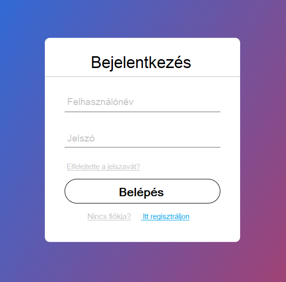

# Jelenlegi helyzet leírása

Az internet elterjedésével a humorforrások is átalakultak, és a viccportálok népszerűsége egyre nőtt. Az emberek szívesen keresnek fel ilyen oldalakat, hogy oldják a stresszt és felviduljanak a mindennapokban. 

Azonban a viccportálok kezelése, frissítése és karbantartása nem kis feladat. A rendszeres tartalomfeltöltés érdekében az adminisztrátoroknak naponta több órát kell eltölteniük új viccek, mémek és humoros tartalmak keresésével, moderálásával, valamint a felhasználói visszajelzések kezelésével.

Mivel az internetes humor gyorsan változik, a trendek követése és az új humorstílusok integrálása elengedhetetlen, hogy a portálok vonzóak maradjanak. A látogatók elvárják:

- A gyors frissítést,
- A humoros tartalmak széles választékát

A viccportálok közönsége nagyrészt nem csak passzív fogyasztói a tartalomnak, hanem szívesen osztják meg saját humoros alkotásaikat is. A felhasználók részvétele és a közösségi interakciók folyamatos odafigyelést és moderálást igényelnek. 

Mindeközben fontos, hogy a viccportálok:

- Ne csak humorforrást jelentsenek,
- Hanem olyan felületet is, ahol a közösség tagjai biztonságban érezhetik magukat,
- Kerüljék az érzékeny témák megsértését és a nem megfelelő tartalmak megjelenését.

A viccportálok számára a relevancia fenntartása kulcsfontosságú, hiszen az online világban a felhasználók gyorsan elpártolnak, ha egy oldal nem frissül rendszeresen, vagy a tartalmak nem tükrözik a legújabb trendeket. 

Ezért a humoros tartalmak szerkesztőinek:

- Folyamatosan követniük kell a közösségi média platformokat és az aktuális mémeket,
- Naprakész anyagokat kell kínálniuk.

Az ilyen portálok hosszú távú fenntarthatóságát befolyásolja az is, hogy miként képesek bevételt generálni, például hirdetéseken keresztül. Ez újabb kihívást jelent, hiszen:

- Meg kell találni az egyensúlyt a felhasználói élmény és a reklámok mennyisége között,
- Ügyelni kell arra, hogy a látogatók ne érezzék túlzsúfoltnak az oldalt.

#  Rendszer Funkcionális Követelmények:

Felhasználói Regisztráció és Bejelentkezés
- A felhasználók regisztrálhatnak e-mail cím és jelszó megadásával, vagy külső fiókok (pl. Facebook, Google) használatával.
- E-mail megerősítés a regisztráció során a felhasználók hitelesítéséhez.
- Jelszó-visszaállítási lehetőség e-mailes értesítéssel.
- A felhasználók bejelentkezés után személyes profilt hozhatnak létre, ahol     megtekinthetik a beküldött vicceiket és a kapott szavazataikat.

Viccek Beküldése és Kategorizálása
- A felhasználók beküldhetnek vicceket szöveges formában
- A beküldött vicceket kategóriákba kell sorolni (pl. "Szőke nős viccek", "Mórickás   viccek", "Felnőtt viccek").
- A moderátorok átnézik és jóváhagyják a beküldött vicceket, mielőtt azok megjelennek a  portálon.

Viccek Megtekintése és Keresése
- A felhasználók böngészhetnek a viccek között kategóriák vagy népszerűség szerint.
- Keresőfunkció, amely lehetővé teszi a felhasználóknak, hogy kulcsszavak alapján   keressenek vicceket.
- Szűrő opciók: kategória, időszak (pl. "legfrissebb", "legnépszerűbb").
- Véletlenszerű vicc funkció, amely egy véletlenszerűen kiválasztott viccet jelenít meg a felhasználónak.

Viccek Értékelése 
- A felhasználók szavazhatnak a viccekre (pl. "Tetszik" vagy "Nem tetszik"), ami befolyásolja a vicc láthatóságát.
- A rendszer képes legyen az értékelések alapján rangsorolni a vicceket, és a legnépszerűbb vicceket kiemelni a főoldalon.

Moderátorok számára elérhető felület, ahol jóváhagyhatják, szerkeszthetik, vagy törölhetik a beküldött vicceket.
- Moderálási eszközök a nem megfelelő tartalmak (pl. sértő, jogsértő viccek) kezelésére, beleértve a felhasználói jelentéseket is.

# Megfelelés a jogi szabályoknak

A magyar GDPR-szabályoknak megfelelően a viccportál nem tárol telefonszámokat és e-mail címeket a felhasználó kifejezett hozzájárulása és jogos cél nélkül. A GDPR értelmében az olyan személyes adatok, mint a telefonszámok és az e-mail címek, érzékeny adatnak minősülnek, és csak akkor gyűjthetők, ha azok kifejezetten szükségesek, például a felhasználók regisztrációja vagy értesítése céljából. A viccportál biztosítja, hogy a felhasználók előre tájékoztatást kapjanak arról, hogyan kerülnek felhasználásra az adataik, és a gyűjtés előtt megkapja a szükséges hozzájárulásokat.

Az adatok védelme érdekében a weboldal szigorú biztonsági intézkedéseket alkalmaz. A felhasználóknak jogukban áll bármikor hozzáférni az adataikhoz, kérhetik azok módosítását vagy törlését. Az adatmegőrzési gyakorlatok a GDPR-irányelveknek megfelelően történnek, így minden elavult vagy már nem szükséges adatot biztonságosan törölnek, miután a céljukat betöltötték.

# Nem Funkcionális Követelmények

Teljesítmény
- Az oldalnak képesnek kell lennie legalább 100 egyidejű felhasználó kiszolgálására.
- A rendszernek a viccek beküldését, megtekintését, és értékelését 5 másodpercen belül kell feldolgoznia, még csúcsidőben is.
- Gyors és hatékony keresési és szűrési funkciók, amelyek nagy mennyiségű adat esetén is jól működnek.

Biztonság
- Az adatokat biztonságosan kell tárolni és titkosítani (pl. jelszavak hash-elése).
- A felhasználói adatok védelme és GDPR-megfelelés biztosítása.
- Rendszeres biztonsági mentések és lehetőség az adatok visszaállítására.

Felhasználói Élmény

- Reszponzív design, amely jól működik asztali gépeken.
- Egyszerű és átlátható navigáció, gyors hozzáférés a különböző vicckategóriákhoz.
- Intuitív felület a viccek beküldésére és a közösségi funkciók használatára (pl. szavazás, kommentelés).

# Adatbázis és Tárolás

Az adatbázis tárolja a felhasználói profilokat, vicceket, kommenteket, értékeléseket, kategóriákat, és a moderációs műveleteket.
Olyan adatbázis-struktúra kialakítása, amely támogatja a skálázhatóságot és a nagy mennyiségű adat kezelését (pl. MySQL, PostgreSQL).

# Viccportál Adatbázis Terv

## Táblák

### 1. `felhasználók`
Tárolja a regisztrált felhasználók adatait, beleértve az adminokat és moderátorokat is.
| Oszlop neve  | Típus  | Leírás  |
|--------------|--------|---------|
| `felhasznalo_id`    | INT    | Egyedi felhasználói azonosító (Elsődleges kulcs) |
| `felhasznalonev`   | VARCHAR| A felhasználók által használt név |
| `email`      | VARCHAR| A felhasználók e-mail címe |
| `jelszo`   | VARCHAR| A felhasználók jelszava elszó (HASH-elve) |
| `csoport`       | ENUM   | Felhasználói szerepkör (admin, moderátor, felhasználó) |
| `mikor_regisztralt` | TIMESTAMP | Regisztráció időpontja |

### 2. `viccek` 
Tárolja a felhasználók által beküldött vicceket.
| Oszlop neve  | Típus  | Leírás  |
|--------------|--------|---------|
| `vicc_id`    | INT    | Egyedi vicc azonosító (Elsődleges kulcs) |
| `felhasznalo_id`    | INT    | A viccet beküldő felhasználó (Külső kulcs a `felhasznalok` táblára) |
| `kategoria_id`| INT    | A vicc kategóriája (Külső kulcs a `kategoriak` táblára) |
| `vicc_szovege`  | TEXT   | Maga a vicc |
| `letrehozva` | TIMESTAMP | Beküldés időpontja |
| `jovahagyott`| BOOLEAN | Jóváhagyás állapota |
| `jovahagyo_id`| INT    | Moderátor, aki jóváhagyta (Külső kulcs a `felhasznalok` táblára) |

### 3. `kategoriak` 
Tárolja a viccek kategóriáit.
| Oszlop neve  | Típus  | Leírás  |
|--------------|--------|---------|
| `kategoria_id`| INT    | Kategória azonosító (Elsődleges kulcs) |
| `kategoria_neve` | VARCHAR | A vicc kategóriájának a neve |

### 4. `ertekelesek` 
A viccekhez adott értékelések (pl. tetszik/nem tetszik).
| Oszlop neve  | Típus  | Leírás  |
|--------------|--------|---------|
| `ertekeles_id`  | INT    | Egyedi értékelés azonosító (Elsődleges kulcs) |
| `vicc_id`    | INT    | Értékelt vicc (Külső kulcs a `viccek` táblára) |
| `felhasznalo_id`    | INT    | Értékelést adó felhasználó (Külső kulcs a `felhasznalok` táblára) |
| `ertekeles` | INT  | Értékelés értéke (1-5) |
| `ertekeles_idopontja` | TIMESTAMP | Az értékelésnek az időpontja |

Itt látható ERD-diagram formában.

# Mellékletek és illusztrációk

# Felhasználó szemszög – Viccportál

Ádám egy hosszú munkanap után szeretne egy kicsit kikapcsolódni, ezért fellép a kedvenc viccportáljára. Miután végigböngészi az új vicceket, talál egyet, amin különösen jól szórakozik, és úgy dönt, hogy megosztja barátaival. Mielőtt ezt megtenné, regisztrál a portálra egy gyors folyamat során, majd a bejelentkezés után lájkolja és kommenteli a viccet. Ezután könnyedén megosztja a poént a közösségi média fiókjain keresztül. Annyira megtetszik neki a portál, hogy ő maga is beküld egy viccet, amelyet néhány óra múlva a moderátor jóváhagy, és kikerül a főoldalra. Ádám izgatottan várja, hogy mennyi pozitív visszajelzést kap a viccére!