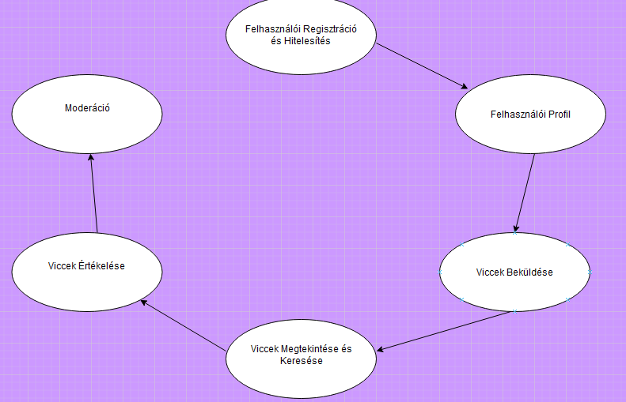
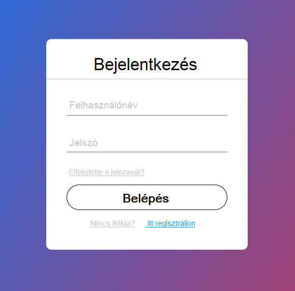
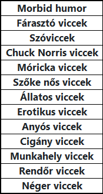
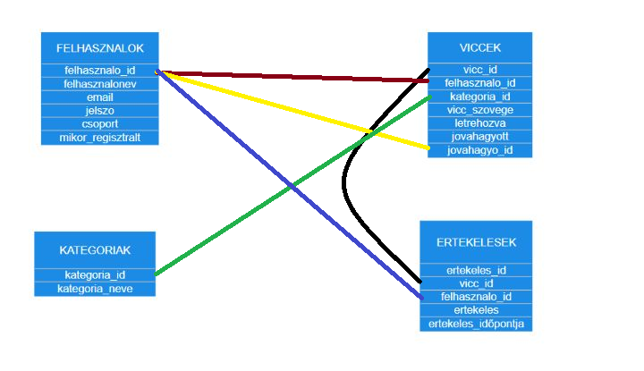

### Rendszerspecifikáció - Viccportál

#### 1. **Általános követelmények**

  **Funkciók:**

  - **Regisztrációs Módszerek:** A felhasználók regisztrálhatnak e-mail cím és jelszó megadásával.
  - **E-mail Megerősítés:** Regisztráció során kötelező az e-mail cím megerősítése a felhasználói fiók aktiválásához.
  - **Felhasználói hitelesítés:** A rendszer funkciói nagy részét csak bejelentkezett felhasználók érhetik el, mint például viccek posztolása.
  - **Jelszó-Visszaállítás:** Jelszó-visszaállító funkció, amely e-mailen keresztül küld egy linket a jelszó módosításához.
  - **Platformok:**
    - Webes felület minden funkcióhoz.
    - **Adattárolás:** A rendszer MySQL adatbázist használ a felhasználói adatok, viccek és tárolására.

#### 2.1. **Felhasználókezelés**
- **Profil Készítése:** Regisztrált felhasználók személyes profilt hozhatnak létre.
- **Profil Tartalom:** A felhasználói profil tartalmazza a beküldött vicceket és azok értékeléseit.
- **Profil Módosítás:** Felhasználók módosíthatják személyes adataikat, jelszavukat, és kezelhetik saját vicceiket.
- **Felhasználói típusok:**
  - **Regisztrált felhasználó:** Posztolhat vicceket és értékelhet más vicceket.
  - **Vendég felhasználó:** Vicceket böngészhet, de nem posztolhat vagy kommentelhet.

#### 2.2. **Admin által elérhető funkciók**
- **Tartalom moderálása:** Az adminisztrátor törölhet vagy szerkeszthet vicceket és ha azok nem felelnek meg a közösségi irányelveknek.
- **Felhasználók kezelése:** A felhasználók blokkolása vagy figyelmeztetések küldése a szabálysértések esetén.

#### 2.3. **Regisztrált felhasználók által elérhető funkciók és viccek Beküldése**
  Funkciók:

- **Vicc beküldése:** A felhasználók vicceket tölthetnek fel különböző kategóriákba (pl. szőke viccek, szóviccek, állatos viccek).
    - **Vicc értékelése:** Lehetőség van a viccek tetszési index szerinti értékelésére (pl.     1-től 5 csillagig).
    - **Kategorizálás:** Minden vicc előre definiált kategóriák szerint kategorizálható (pl. "Felnőtt viccek", "Szőke nős viccek").
    - **Kategória kiválasztása:** A felhasználók kiválaszthatják, milyen típusú vicceket szeretnének látni.
    - **Moderálás:** Beküldött vicceket a moderátorok előszűrik, mielőtt azok megjelennek az oldalon.
    - **Jelentések Kezelése:** Moderátorok kezelhetik a felhasználói jelentéseket és eltávolíthatják a nem megfelelő tartalmakat.
    - **Szűrés és Figyelmeztetés:** Szűrési és figyelmeztetési funkciók a jogsértő tartalmak ellen.
    - **Böngészés:** Felhasználók böngészhetnek a viccek között kategóriák és népszerűség alapján.
    - **Keresés:** Kulcsszavas keresési funkció biztosítja a viccek gyors keresését.
    - **Szűrés:** Szűrő funkciók elérhetők időszak szerint (pl. "legfrissebb", "legnépszerűbb").
    - **Véletlenszerű Vicc:** Véletlenszerű vicc funkció, amely egy random viccet jelenít meg.

  

  #### **Viccek Értékelése**

  **Funkciók:**

  - **Értékelés:** Felhasználók szavazhatnak viccekre ("Tetszik" vagy "Nem tetszik").
  - **Rangsorolás:** Viccek láthatósága és rangsorolása a szavazatok számától függ.
  - **Kiemelés:** A legnépszerűbb viccek kiemelten jelennek meg a főoldalon.

#### 2.4. **Vendég felhasználók által elérhető funkciók**
- **Viccek böngészése:** A vendég felhasználók szabadon böngészhetik a vicceket, de nem posztolhatnak és nem értékelhetnek.

#### 3. **Felülettel szemben támasztott követelmények**

#### 3.1. **Webes felület**
- **Könnyű navigáció:** A webes felület egyszerű, letisztult dizájnt használ, ahol gyorsan elérhetők a kategóriák, friss viccek, és a legnépszerűbb tartalmak.
- **Keresési funkció:** Kulcsszavak alapján lehet keresni vicceket.

#### 4. **Vicctípusok és kategóriák**

### 5. **Adatvédelem**
- A felhasználói adatok védelmét biztosítani kell (pl. jelszavak titkosítása, adatvédelmi szabályok betartása).

### 6. **Hardver és szoftver követelmények**
- **Webes szerver:** Nginx webserver használata.
- **Adatbázis:** MySQL adatbázis szükséges a viccek és felhasználói adatok tárolására.

# Viccportál Adatbázis Terv

## Táblák

### 1. `felhasználók`
Tárolja a regisztrált felhasználók adatait, beleértve az adminokat és moderátorokat is.
| Oszlop neve  | Típus  | Leírás  |
|--------------|--------|---------|
| `felhasznalo_id`    | INT    | Egyedi felhasználói azonosító (Elsődleges kulcs) |
| `felhasznalonev`   | VARCHAR| A felhasználók által használt név |
| `email`      | VARCHAR| A felhasználók e-mail címe |
| `jelszo`   | VARCHAR| A felhasználók jelszava elszó (HASH-elve) |
| `csoport`       | ENUM   | Felhasználói szerepkör (admin, moderátor, felhasználó) |
| `mikor_regisztralt` | TIMESTAMP | Regisztráció időpontja |

### 2. `viccek`
Tárolja a felhasználók által beküldött vicceket.
| Oszlop neve  | Típus  | Leírás  |
|--------------|--------|---------|
| `vicc_id`    | INT    | Egyedi vicc azonosító (Elsődleges kulcs) |
| `felhasznalo_id`    | INT    | A viccet beküldő felhasználó (Külső kulcs a `felhasznalok` táblára) |
| `kategoria_id`| INT    | A vicc kategóriája (Külső kulcs a `kategoriak` táblára) |
| `vicc_szovege`  | TEXT   | Maga a vicc |
| `letrehozva` | TIMESTAMP | Beküldés időpontja |
| `jovahagyott`| BOOLEAN | Jóváhagyás állapota |
| `jovahagyo_id`| INT    | Moderátor, aki jóváhagyta (Külső kulcs a `felhasznalok` táblára) |

### 3. `kategoriak`
Tárolja a viccek kategóriáit.
| Oszlop neve  | Típus  | Leírás  |
|--------------|--------|---------|
| `kategoria_id`| INT    | Kategória azonosító (Elsődleges kulcs) |
| `kategoria_neve` | VARCHAR | A vicc kategóriájának a neve |

### 4. `ertekelesek`
A viccekhez adott értékelések (pl. tetszik/nem tetszik).
| Oszlop neve  | Típus  | Leírás  |
|--------------|--------|---------|
| `ertekeles_id`  | INT    | Egyedi értékelés azonosító (Elsődleges kulcs) |
| `vicc_id`    | INT    | Értékelt vicc (Külső kulcs a `viccek` táblára) |
| `felhasznalo_id`    | INT    | Értékelést adó felhasználó (Külső kulcs a `felhasznalok` táblára) |
| `ertekeles` | INT  | Értékelés értéke (1-5) |
| `ertekeles_idopontja` | TIMESTAMP | Az értékelésnek az időpontja |

Itt látható ERD-diagram formában.

