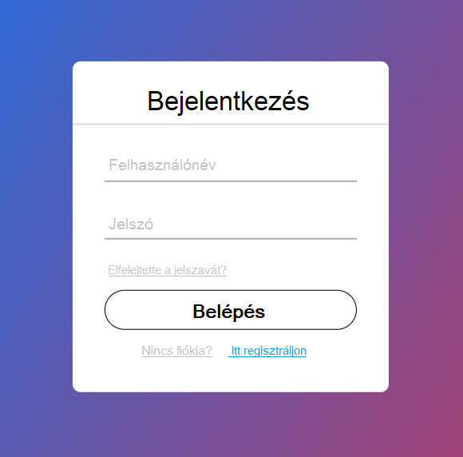
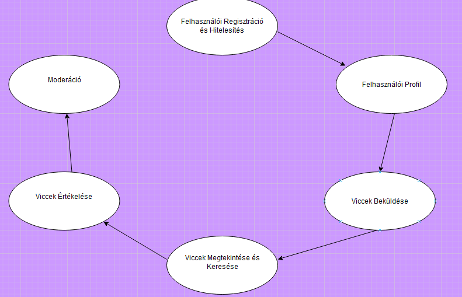

### Rendszerspecifikáció - Viccportál

#### 1. **Általános követelmények**

**Funkciók:**

- **Regisztrációs Módszerek:** A felhasználók regisztrálhatnak e-mail cím és jelszó megadásával.
  A regisztráció során az adatok validációja biztosítja, hogy a felhasználó által megadott e-mail cím formátuma helyes legyen, illetve a jelszó megfeleljen a minimális követelményeknek (például legalább 8 karakter, kis- és nagybetűk, számok, speciális karakterek).

- **E-mail Megerősítés:** Regisztráció során kötelező az e-mail cím megerősítése a felhasználói fiók aktiválásához.
  A regisztráció során egy automatikus e-mail kerül kiküldésre, amely egy aktiváló linket tartalmaz a felhasználói fiók véglegesítéséhez.
  Az e-mailben található link meghatározott ideig érvényes (pl. 24 óra), és az aktiválási folyamat során a rendszer értesítést küld, ha a link lejárt.

- **Felhasználói hitelesítés:** A rendszer webes felületén a felhasználók regisztrálhatnak, bejelentkezhetnek, vicceket posztolhatnak, és kommentelhetnek.
- **Jelszó-Visszaállítás:** Jelszó-visszaállító funkció, amely e-mailen keresztül küld egy linket a jelszó módosításához.
Platformok:
Webes Felület: A rendszer webes felületén a felhasználók regisztrálhatnak, bejelentkezhetnek, vicceket posztolhatnak, és kommentelhetnek.
- Webes felület minden funkcióhoz.
  Adminisztrációs Felület: A rendszergazdák számára külön adminisztrációs felület érhető el, amely lehetőséget biztosít a felhasználói fiókok kezelésére, a moderációra, és a tartalmak ellenőrzésére.

  

#### 2.1. **Felhasználókezelés**
- **Profil Készítése:** Regisztrált felhasználók személyes profilt hozhatnak létre.
- **Profil Tartalom:** A felhasználói profil tartalmazza a beküldött vicceket és azok értékeléseit.
- **Profil Módosítás:** Felhasználók módosíthatjávk személyes adataikat, jelszavukat, és kezelhetik saját vicceiket.
- **Felhasználói típusok:**
  - **Regisztrált felhasználó:** Posztolhat vicceket és értékelhet más vicceket.
  - **Vendég felhasználó:** Vicceket böngészhet, de nem posztolhat vagy kommentelhet.

#### 2.2. **Admin által elérhető funkciók**
- **Tartalom moderálása:** Az adminisztrátor törölhet vagy szerkeszthet vicceket és ha azok nem felelnek meg a közösségi irányelveknek.
- **Tartalom moderálása:** Melőtta vicc megjelenik az oldalon az adminisztrátornak kel jóváhagyni a viccet.
- **Felhasználók kezelése:** A felhasználók blokkolása vagy figyelmeztetések küldése a szabálysértések esetén.

  
#### 2.3. **Regisztrált felhasználók által elérhető funkciók és viccek Beküldése**
  Funkciók:

- **Vicc beküldése:** A felhasználók vicceket tölthetnek fel különböző kategóriákba (pl. szőke viccek, szóviccek, állatos viccek).
    - **Vicc értékelése:** Lehetőség van a viccek tetszési index szerinti értékelésére (pl.     1-től 5 csillagig).
    - **Kategorizálás:** Minden vicc előre definiált kategóriák szerint kategorizálható (pl. "Felnőtt viccek", "Szőke nős viccek").
    - **Kategória kiválasztása:** A felhasználók kiválaszthatják, milyen típusú vicceket szeretnének látni.
    - **Moderálás:** Beküldött vicceket a moderátorok előszűrik, mielőtt azok megjelennek az oldalon.
    - **Jelentések Kezelése:** Moderátorok kezelhetik a felhasználói jelentéseket és eltávolíthatják a nem megfelelő tartalmakat.
    - **Szűrés és Figyelmeztetés:** Szűrési és figyelmeztetési funkciók a jogsértő tartalmak ellen.
    - **Böngészés:** Felhasználók böngészhetnek a viccek között kategóriák és népszerűség alapján.
    - **Keresés:** Kulcsszavas keresési funkció biztosítja a viccek gyors keresését.
    - **Szűrés:** Szűrő funkciók elérhetők időszak szerint (pl. "legfrissebb", "legnépszerűbb").
    - **Véletlenszerű Vicc:** Véletlenszerű vicc funkció, amely egy random viccet jelenít meg.

    

- **Adattárolás:**

    MySQL Adatbázis: A rendszer egy MySQL adatbázist használ a felhasználói adatok, viccek és egyéb kapcsolódó információk tárolására.
    Biztonsági Mentés: Rendszeres adatbázis-biztonsági mentések készülnek az adatvesztés elkerülése érdekében.
    Adatvédelem: Az adatbázisban tárolt személyes adatokat titkosítással és anonimizálási technikákkal védik az adatbiztonsági előírásoknak megfelelően.

  

- **Moderáció és Tartalomszűrés:**
A moderátorok jogosultságot kapnak a felhasználók által beküldött tartalmak felülvizsgálatára és szükség esetén törlésére.

- **Felhasználói Interakciók**:
Viccek Posztolása és Értékelése: A felhasználók saját vicceket posztolhatnak, illetve értékelhetik mások vicceit kedvelésekkel vagy visszajelzésekkel.

